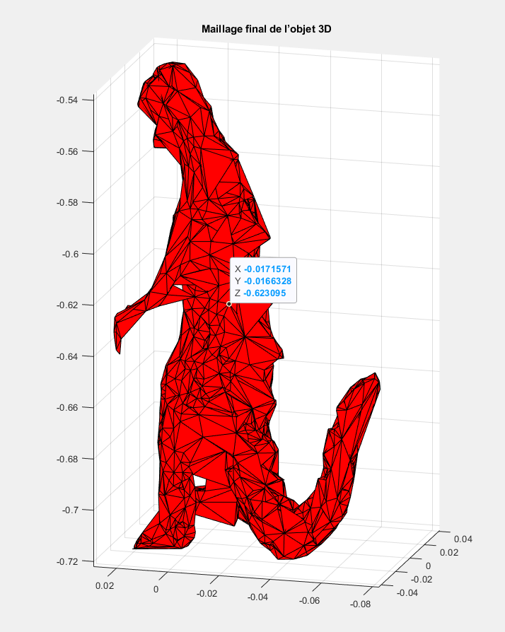

# Extraction of the 3D Medial Axis and Surface Reconstruction Based on Superpixels

## Project Overview

**Extraction of the 3D Medial Axis and Surface Reconstruction Based on Superpixels** is a MATLAB project that aims to reconstruct a 3D surface mesh of an object from multiple images. The approach builds a multi-stage pipeline: first, each image is segmented into superpixels to isolate the object of interest using **color** (Lab color thresholds) and **shape compactness** criteria. Then, an approximate **medial axis** (skeleton) of the object is extracted in 2D for each view by applying Delaunay triangulation on the object’s silhouette. Finally, leveraging multiple views (multi-view stereo images with known camera projections), the pipeline performs a volumetric 3D reconstruction. It uses **tetrahedral filtering** (Delaunay tetrahedralization and barycenter visibility checks) to carve out the object’s volume consistent with all silhouettes, and produces a 3D **surface mesh** of the object. The result is a triangular mesh approximating the object’s shape, reconstructed from its images.

## Repository Structure

The repository is organized as follows:

- `main_Partie_1_2_3.m` — Main script for Parts 1–3 (segmentation & 2D analysis)  
- `main_Partie_4.m` — Main script for Part 4 (3D reconstruction & meshing)  
- `Faibles_gradients.m` — Moves superpixel centers to low-gradient areas (preprocessing)  
- `Algorithme_SLIC.m` — SLIC superpixel segmentation algorithm implementation  
- `Optimisation_connexe.m` — Merges small superpixels based on connectivity (size threshold)  
- `Segmentation_couleur.m` — Creates a binary mask using Lab color thresholding  
- `Segmentation_compacite.m` — Creates a binary mask for compact regions (shape filter)  
- `Filtrage_centres.m` — Filters out Delaunay triangle centers outside the silhouette mask  
- `Trace_Axe_Median.m` — Plots the 2D medial axis from the filtered Delaunay centers  
- `viff.xy` — 2D multi-view correspondence data (for point reconstructions)  
- `donnees.mat` — Precomputed 3D points and other project variables (for Part 4)  
- `mask.mat` — Binary silhouette masks for the 36 input images (one per view)  
- `dino_Ps.mat` — Camera projection matrices for each input view (P{i} for 36 images)  
- `Simulation/` — Folder for simulation results (output images, meshes, etc.)  
- `images/` — Folder with source images (e.g., `viff.00X.ppm` sequence)  
- `README.md` — Project documentation (this file)  

## How It Works

This project’s pipeline consists of several key steps, from 2D image processing to 3D surface reconstruction:

### 1. Image Segmentation (Superpixels)

Each input image is converted to the Lab color space for robust color segmentation. A grid of superpixel centers is initialized across the image and adjusted to avoid strong edges (centers move to low-gradient regions). The **SLIC superpixel algorithm** is then applied: pixels are grouped into superpixels based on proximity in color (Lab) and space, through iterative localized k-means clustering. Small superpixels are merged with larger neighbors to ensure connectivity.

The result is an over-segmentation of the image. Next, the object of interest is isolated by applying a **color threshold** (on the Lab channels to create a binary mask for likely object regions) and a **compactness filter** (eliminating superpixels that are elongated or irregular, ensuring only compact object regions remain). This yields a clean **binary mask** of the object’s silhouette in each image.

### 2. Medial Axis Extraction (2D)

Given the binary silhouette mask in an image, the algorithm computes an approximation of the **medial axis** (centerline) of that 2D shape. It does this by extracting the object’s contour and performing a **Delaunay triangulation** on a set of points sampled along the contour. For each Delaunay triangle inside the shape, the **circumcenter** (center of the circumscribed circle) is computed.

These circumcenters lie roughly along the mid-lines of the shape. By filtering out any circumcenters that fall outside the object mask, we obtain a set of points representing the medial axis in that view. This 2D skeletal representation is useful for understanding the object’s internal structure in each image.

### 3. 3D Tetrahedralization & Barycenter Filtering

Once silhouettes (and optionally medial points) are obtained from all views, the method reconstructs the object’s volume in 3D. First, a set of candidate **3D points** is prepared – for example, by using available correspondences or an initial visual hull estimation from the multiple silhouettes.

A **Delaunay tetrahedralization** is then performed on these points, forming a volumetric mesh of tetrahedra covering the potential object space. The crucial filtering step uses the silhouettes from all camera views to carve out the correct shape: for each tetrahedron, multiple sample points inside it (including the centroid and biased barycenters towards each vertex) are projected into each input image.

If **any** of these sample points projects outside the object’s silhouette in any view, that tetrahedron is discarded (it lies outside the true object). This **barycenter filtering** ensures that only tetrahedra which are fully consistent with *all* view silhouettes (i.e., inside the intersection of all viewing cones) are kept. After this step, the remaining tetrahedral mesh approximates the object’s volume (it is essentially an approximate visual hull).

### 4. Surface Mesh Extraction

In the final stage, the **surface mesh** of the object is extracted from the filtered tetrahedral volume. The algorithm collects all triangular faces of the remaining tetrahedra and identifies those faces that are **unshared**, meaning a face is only part of one tetrahedron and not coincident with a neighboring tetrahedron. Such faces lie on the boundary between empty space and the kept volume.

By gathering all these outer faces, we obtain a triangular **surface mesh** representing the exterior of the object. This surface mesh can then be visualized or exported – it is the reconstructed 3D model of the object, derived purely from the 2D segmentations and geometric consistency.

*(Internally, the provided camera projection matrices `dino_Ps.mat` and image masks `mask.mat` are used to project and test tetrahedron points in each view. The scripts automate this pipeline to output the final mesh.)*

## Usage Instructions

**Prerequisites:** This code requires MATLAB and the Image Processing Toolbox. All necessary data (sample images, masks, and camera matrices) are provided in the repository.

### To run the project:

1. Set up data: Ensure the images/ folder (with input images) and the .mat files (mask.mat, dino_Ps.mat, etc.) are in the MATLAB path or current working directory. The sample dataset includes 36 images (viff.001.ppm, viff.002.ppm, ...) and their corresponding calibration matrices.

2. Run 2D segmentation: Open and run main_Partie_1_2_3.m. This will execute the first three parts of the pipeline:
      - It loads the input images, converts them to Lab, and initializes superpixel centers.
      - Runs the superpixel segmentation and merges small regions.
      - Applies color and compactness filtering to generate binary masks for each image.
      - Extracts the 2D medial axis points for each silhouette (via Delaunay triangulation on contours).
      - (The script may display intermediate results such as the segmented image and skeleton overlay for each view.)
      - On completion, it will save or make available the binary masks and Delaunay center points (medial axis) for use in the next stage.

3. Run 3D reconstruction: Next, run main_Partie_4.m. This script performs the 3D modeling part of the pipeline:
    - It loads the camera projection matrices and either uses provided 3D points (donnees.mat) or computes an initial 3D point set from the 2D data.
    - Performs Delaunay tetrahedralization on the point set to create a volumetric mesh.
    - Carries out the barycenter projection filtering: tetrahedra not consistent with all silhouettes are removed.
    - Extracts the outer surface triangles from the remaining tetrahedra and displays the resulting 3D surface mesh.
    - (The final 3D mesh can be visualized in the MATLAB figure window. The script may also save the mesh or relevant output images to the Simulation/ folder for reference.)

After running these scripts in order, you should see output figures illustrating the segmentation results and the final reconstructed 3D surface. You can adjust parameters (number of superpixels, color thresholds, etc.) in the scripts for different datasets or to refine results.

## Example Results

After running the pipeline on the example dataset (36 multi-view images of a small dinosaur figurine), the following results are obtained:

- **Segmented Binary Masks**

Each input image is converted into a binary mask isolating the object. For example: the left image below shows one original input view, the 2nd shows the superpixel segmentation obtained. The 3rd presents the color segmentation and the last photo shows the compacity segmentation.

- **2D Medial Axis Extraction**

From each mask, the medial axis (skeleton) of the shape is computed. The interior points (circumcenters of Delaunay triangles) are plotted, often forming a skeletal curve. The 1st line shows the 2D Medial Axis Extraction from the color segmentation while the 2nd is presenting the processus for the compacity segmentation.
  
- **Initial 3D Delaunay Tetrahedralization**

The extracted 2D medial axis points from all views are projected into 3D space. A Delaunay tetrahedralization is applied to these 3D points, forming a volumetric mesh of tetrahedra. This structure may still contain tetrahedra outside the shape.

- **Filtered 3D Tetrahedralization**

To ensure consistency with the object silhouette, tetrahedra whose barycenters project outside all silhouettes are discarded. This filtering improves the relevance and accuracy of the final shape reconstruction.

- **Final Surface Mesh Reconstruction**

A surface mesh is extracted from the filtered tetrahedrization by selecting faces shared by only one tetrahedron. The resulting mesh approximates the outer surface of the object in 3D.

Result types produced by this pipeline include binary silhouette masks for each image, the set of medial axis center points in each view, and the 3D surface mesh model. The intermediate and final outputs can be visualized as shown above. (In practice, you would replace the placeholder images with actual screenshots or saved figures from your simulation results.)

## Limitations

While the pipeline successfully integrates segmentation and geometric filtering to produce a 3D model, there are a few limitations to note. Sensitivity to mask quality is one issue: the accuracy of the 3D reconstruction depends heavily on the quality of the initial binary masks. Any segmentation errors (missing parts of the object or including background noise) can lead to an incomplete or incorrect medial axis and hence an inaccurate mesh. The method also struggles if the object’s shape yields disconnected components or holes in the silhouette – a continuous medial axis and consistent tetrahedral filtering assume the object is a single connected volume in each view. Additionally, the depth precision is limited by the silhouette-based approach: since the reconstruction uses only outline consistency (a visual hull concept), fine geometric details or concave indentations of the object that do not show up in the silhouettes will not be captured, resulting in a coarse approximation of the true shape.

## Real-World Applications

Despite its experimental nature, a pipeline like this could be applied to real-world scenarios. In medical imaging, for instance, one could extract 3D anatomical structures (such as organs or bones) from a series of 2D scans or X-ray images; the medial axis might provide insightful shape descriptors in such reconstructions. In robotics and computer vision, a similar approach can help robots or systems understand object geometry from multiple camera views – for example, segmenting an object from different angles and reconstructing its 3D form to aid in object recognition or grasp planning. This combination of superpixel segmentation and multi-view reconstruction could enhance perception in any field where building 3D models from 2D imagery is valuable.
